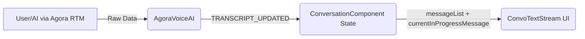
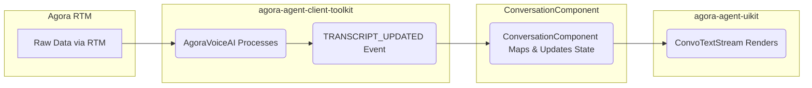

# Let's Talk Text: Streaming Transcriptions in Your Conversational AI App


So, you've built an amazing conversational AI app using Agora, maybe following our main [Conversational AI Guide](./GUIDE.md). Your users can chat with an AI, just like talking to a person. But what about _seeing_ the conversation? That's where text streaming comes in.

This guide focuses on adding real-time text transcriptions to your audio-based AI conversations. Think of it as subtitles for your AI chat.

## Prerequisites

Install the Agora client toolkit and UI kit:

```bash
pnpm add agora-agent-client-toolkit agora-agent-uikit agora-rtm
```

- **`agora-agent-client-toolkit`** provides the `AgoraVoiceAI` class for receiving transcription data over RTM, managing message state, and emitting updates via events.
- **`agora-agent-uikit`** provides `ConvoTextStream` for transcript UI and `AgentVisualizer` for agent state UI.
- **`agora-rtm`** is the Agora Real-Time Messaging SDK — the transport layer that carries transcript data from the agent to the client.

Why bother adding text when the primary interaction is voice? Good question! Here's why it's a game-changer:

1. **Accessibility is Key**: Text opens up your app to users with hearing impairments. Inclusivity matters!
2. **Memory Aid**: A text transcript lets users quickly scan back through the conversation.
3. **Loud Places, No Problem**: Transcriptions ensure the message gets through, even if the audio is hard to hear.
4. **Did it Hear Me Right?**: Seeing the transcription confirms the AI understood the user correctly (or reveals when it didn't!).
5. **Beyond Voice**: Lists, code snippets, and URLs are easier to digest visually. Text streaming enables true multi-modal interaction.

Ready to add this superpower to your app? Let's dive in.

## The Blueprint: How Text Streaming Fits In

Adding text streaming involves three main players in your codebase:

1. **The Brains (`agora-agent-client-toolkit`)**: The `AgoraVoiceAI` class. It uses RTM to receive transcription data, manages message states (e.g., "is the AI still talking?"), and emits updates via events.
2. **The Face (`ConvoTextStream` and `AgentVisualizer` from `agora-agent-uikit`)**: Pre-built UI components for transcript history and agent state.
3. **The Conductor (`ConversationComponent.tsx`)**: Handles the Agora RTC/RTM connection, initializes `AgoraVoiceAI`, subscribes to transcript and state events, remaps UIDs, adapts the transcript shape, and passes data down to the UI kit.

Here's how they communicate:



Raw data arrives from the agent over RTM. `AgoraVoiceAI` processes it and emits transcript events. `ConversationComponent` remaps UIDs and updates state. `ConvoTextStream` renders the result.

## Following the Data: The Message Lifecycle



1. **RTM Stream**: Transcription data arrives via Agora RTM — both user speech and AI agent output.
2. **Message Processing**: `AgoraVoiceAI` processes raw chunks, identifies user vs. agent, and tracks turn status.
3. **Event Emission**: Emits `TRANSCRIPT_UPDATED` with a `TranscriptHelperItem[]` array.
4. **State Updates**: `ConversationComponent` remaps UIDs, separates completed and in-progress turns, updates React state.
5. **UI Rendering**: `ConvoTextStream` re-renders with the new message list.

This pipeline handles messages that are still streaming ("in-progress"), fully delivered ("completed"), or cut off ("interrupted").

## Decoding the Data: Message Types

### User Transcriptions (What the User Said)

```typescript
interface UserTranscription {
  object: 'user.transcription';
  final: boolean; // Is this the final, complete transcription?
}
```

The `final` flag is important — intermediate results may change slightly before the turn ends.

### Agent Transcriptions (What the AI is Saying)

```typescript
interface AgentTranscription {
  object: 'assistant.transcription';
  quiet: boolean;       // Was this generated during a quiet period?
  turn_seq_id: number;  // Unique ID for this conversational turn
  turn_status: TurnStatus; // IN_PROGRESS, END, or INTERRUPTED
}
```

Agent messages often arrive word-by-word or phrase-by-phrase. The `turn_status` tells you when the AI starts and finishes speaking.

### Message Interruptions

When a user starts talking while the AI is still speaking, an interrupt is sent. `AgoraVoiceAI` uses this to mark the in-progress AI message as `INTERRUPTED` in the transcript history.

## Meet `AgoraVoiceAI`: The Heart of Text Streaming

The `AgoraVoiceAI` class from `agora-agent-client-toolkit` handles:

1. **Listening**: Subscribes to the RTM channel to receive transcription data.
2. **Processing**: Decodes messages, identifies user vs. agent, and tracks turn status.
3. **Managing State**: Tracks whether each message is streaming (`IN_PROGRESS`), finished (`END`), or cut off (`INTERRUPTED`).
4. **Ordering & Buffering**: Ensures messages are handled in the correct sequence.
5. **Notifying**: Emits `TRANSCRIPT_UPDATED` whenever the transcript history changes.

### Message Status

```typescript
// From agora-agent-client-toolkit
export enum TurnStatus {
  IN_PROGRESS = 0, // Still being received/streamed (AI is talking)
  END = 1,         // Finished normally
  INTERRUPTED = 2, // Cut off before completion
}
```

Your UI uses this to decide whether to show a streaming indicator or treat the message as final.

### Render Modes

```typescript
export enum TranscriptHelperMode {
  TEXT = 'text',   // Each agent message chunk is a complete block (recommended)
  WORD = 'word',   // Word-by-word streaming when timing info is available
  CHUNK = 'chunk', // Chunk-based streaming
}
```

This quickstart uses `TranscriptHelperMode.TEXT`.

## Wiring Up `AgoraVoiceAI` in `ConversationComponent`

Initialize `AgoraVoiceAI` inside a `useEffect` that fires only after `joinSuccess` — this ensures the RTC client is connected and avoids React StrictMode double-initialization.

```typescript
import {
  AgoraVoiceAI,
  AgoraVoiceAIEvents,
  AgentState,
  TranscriptHelperMode,
  TurnStatus,
  type TranscriptHelperItem,
  type UserTranscription,
  type AgentTranscription,
} from 'agora-agent-client-toolkit';
import {
  AgentVisualizer,
  ConvoTextStream,
  type AgentVisualizerState,
  type IMessageListItem,
} from 'agora-agent-uikit';

type ToolkitMessage = TranscriptHelperItem<Partial<UserTranscription | AgentTranscription>>;

// Inside ConversationComponent:
const [rawTranscript, setRawTranscript] = useState<ToolkitMessage[]>([]);
const [agentState, setAgentState] = useState<AgentState | null>(null);

useEffect(() => {
  if (!joinSuccess || !client) return;

  let cancelled = false;

  (async () => {
    try {
      const ai = await AgoraVoiceAI.init({
        rtcEngine: client,
        rtmConfig: { rtmEngine: rtmClient },
        renderMode: TranscriptHelperMode.TEXT,
        enableLog: true,
      });

      ai.on(AgoraVoiceAIEvents.TRANSCRIPT_UPDATED, (messages) => {
        if (!cancelled) setRawTranscript(messages as ToolkitMessage[]);
      });
      ai.on(AgoraVoiceAIEvents.AGENT_STATE_CHANGED, (_, event) => {
        if (!cancelled) setAgentState(event.state);
      });

      ai.subscribeMessage(agoraData.channel);
      console.log('[ConversationalAI] toolkit connected, listening for transcripts');
    } catch (error) {
      if (!cancelled) console.error('[ConversationalAI] init error:', error);
    }
  })();

  return () => {
    cancelled = true;
    try {
      const ai = AgoraVoiceAI.getInstance();
      if (ai) {
        ai.unsubscribe();
        ai.destroy();
      }
    } catch {}
    setRawTranscript([]);
  };
  // client and rtmClient are stable for the component lifetime
  // eslint-disable-next-line react-hooks/exhaustive-deps
}, [joinSuccess]);
```

### Why `joinSuccess` instead of mount?

React StrictMode mounts components twice in development. The fake first mount's `joinSuccess` is always `false`, so the guard prevents any double-init. By the time `joinSuccess` becomes `true`, the double-mount cycle is already done.

### Why remap `uid === '0'`?

The toolkit assigns `uid = "0"` to the local user's speech (since the user's actual UID is unknown at init time). The uikit's `isAIMessage` check treats `uid === 0` as an AI message. Without remapping, your own speech appears on the wrong side of the chat.

## Separating In-Progress from Completed Messages

This project no longer uses `transcriptToMessageList()` from the uikit at runtime. Instead, it adapts the transcript items locally into the `IMessageListItem` shape expected by `ConvoTextStream`:

```typescript
import { TurnStatus } from 'agora-agent-client-toolkit';
import type { IMessageListItem } from 'agora-agent-uikit';

function toMessageListItem(item: ToolkitMessage): IMessageListItem {
  return {
    turn_id: item.turn_id,
    uid: Number(item.uid) || 0,
    text: typeof item.text === 'string' ? item.text : '',
    status: item.status as unknown as IMessageListItem['status'],
    createdAt: typeof item._time === 'number' ? item._time * 1000 : undefined,
  };
}

const transcript = useMemo(() => {
  const localUID = String(client.uid);
  return rawTranscript.map((m) =>
    m.uid === '0' ? { ...m, uid: localUID } : m
  );
}, [rawTranscript, client.uid]);

// Completed turns (END + INTERRUPTED) become the scrollable message history.
// INTERRUPTED must be included — if the agent's first turn is cut off,
// messageList stays empty and ConvoTextStream never auto-opens.
const messageList = useMemo(
  () => transcript.filter((m) => m.status !== TurnStatus.IN_PROGRESS).map(toMessageListItem),
  [transcript]
);

// The single in-progress turn, if any, is shown as a live streaming bubble.
const currentInProgressMessage = useMemo(() => {
  const m = transcript.find((x) => x.status === TurnStatus.IN_PROGRESS);
  return m ? toMessageListItem(m) : null;
}, [transcript]);
```

The local adapter is intentional. The current repo hit a browser runtime issue with the uikit converter export, so the quickstart now converts transcript items itself.

## Rendering with `ConvoTextStream`

Drop `ConvoTextStream` into your JSX. It handles smart scrolling, auto-open on first message, mobile responsiveness, and streaming indicators. This quickstart also renders `AgentVisualizer` from RTM agent state:

```typescript
import { AgentVisualizer, ConvoTextStream } from 'agora-agent-uikit';

<AgentVisualizer state={visualizerState} size="lg" />
<ConvoTextStream
  messageList={messageList}
  currentInProgressMessage={currentInProgressMessage}
  agentUID={agentUID}
  className="conversation-transcript"
/>
```

`agentUID` tells the component which messages came from the AI vs. the user, so it can render them on the correct side of the chat.

`visualizerState` is mapped from `AgentState` values:

- `listening` → `listening`
- `thinking` → `analyzing`
- `speaking` → `talking`
- `idle` / `silent` → `ambient`

### What `ConvoTextStream` does for you

- **Smart auto-scroll**: Follows new messages when you're at the bottom; stays put when you scroll up to read history
- **Auto-open**: Panel opens automatically when the first message arrives (desktop only)
- **Streaming indicator**: Shows a live animation while the agent's current turn is in progress
- **Interrupted turns**: Displays completed text even for turns the user cut off
- **Mobile layout**: compact floating panel sized above the mic controls

## Setting Up the RTM Client

The RTM client must be created, logged in, and subscribed to the channel **before** `ConversationComponent` mounts — the toolkit needs a fully connected RTM client at init time.

Create it in `LandingPage` as part of the session setup:

```typescript
const { default: AgoraRTM } = await import('agora-rtm');
const rtm = new AgoraRTM.RTM(
  process.env.NEXT_PUBLIC_AGORA_APP_ID!,
  String(Date.now())
);
await rtm.login({ token: responseData.token });
await rtm.subscribe(responseData.channel);
```

Then pass it as a prop to `ConversationComponent`. On end conversation, call `rtmClient.logout()` in `LandingPage` — RTM is owned by the same scope that created it.

For token renewal, this project now uses separate renewal requests:

- RTC renews with the post-join RTC UID
- RTM renews with the universal `uid=0` token

## Token Requirements

The token used for RTM login must be generated with `RtcTokenBuilder.buildTokenWithRtm()` — a standard RTC-only token does not grant RTM access.

```typescript
// In your token generation route:
import { RtcTokenBuilder, RtcRole } from 'agora-token';

const token = RtcTokenBuilder.buildTokenWithRtm(
  APP_ID,
  APP_CERTIFICATE,
  channelName,
  uid,
  RtcRole.PUBLISHER,
  expirationTime,
  expirationTime,
);
```

When the token nears expiry, renew both transports with their respective tokens:

```typescript
const { rtcToken, rtmToken } = await onTokenWillExpire(joinedUID.toString());
await client?.renewToken(rtcToken);
await rtmClient.renewToken(rtmToken);
```

## Agent-Side Configuration

Text streaming requires the agent to be started with RTM enabled. In `app/api/invite-agent/route.ts`:

```typescript
const agent = new Agent({
  // ...
  advancedFeatures: { enable_rtm: true },
});
```

Without `enable_rtm: true`, the agent joins the channel but never sends transcript messages over RTM, so `TRANSCRIPT_UPDATED` will never fire.
